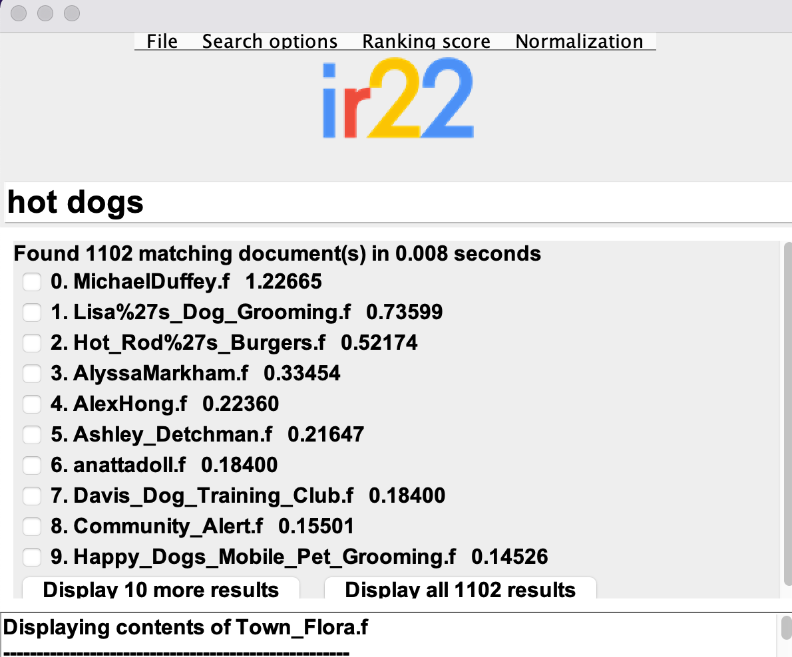
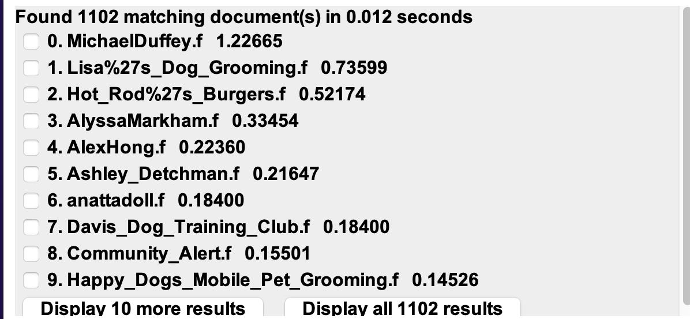
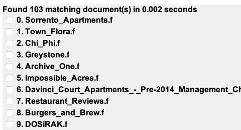
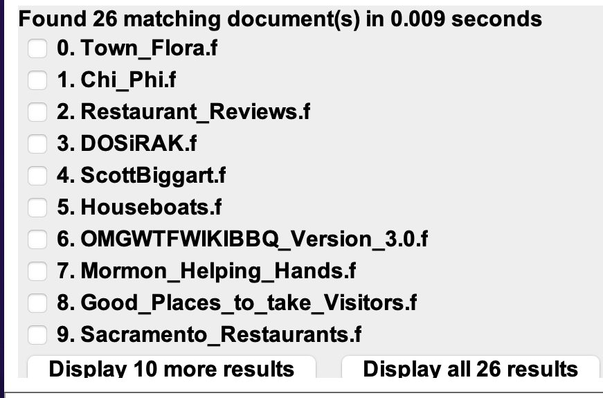

# Information Retrieval System in Java with GUI
The system stores an inverted index of the tokens to search into disk.
The database indexed is the DavisWiki: https://daviswiki.org/

## How to Run
1. Install Java 8
2. Run ``sh compile_all.sh``
3. Run ``sh run_search_engine.sh``

## Features
- **Relevance Feedback**: User can select most relevant results for his/her search and recompute search, future searchs adapt to this
- **K-gram indexes**
- **Wildcard queries**
- **Spelling correction**
- **Phrase queries**
- **Algorithmic ranked searchs**:
	- **TF-IDF:** https://en.wikipedia.org/wiki/Tf%E2%80%93idf
	- **PageRank:** https://en.wikipedia.org/wiki/PageRank
	- **HITS:** https://en.wikipedia.org/wiki/HITS_algorithm

## Demo
| Query Type         | Results for ``Hot dogs``   
|    ---             |          ---              
| Ranked (PageRank)  | 
| Ranked (TF-IDF)    |    
| Intersection Query |   
| Phrase Query       |       
